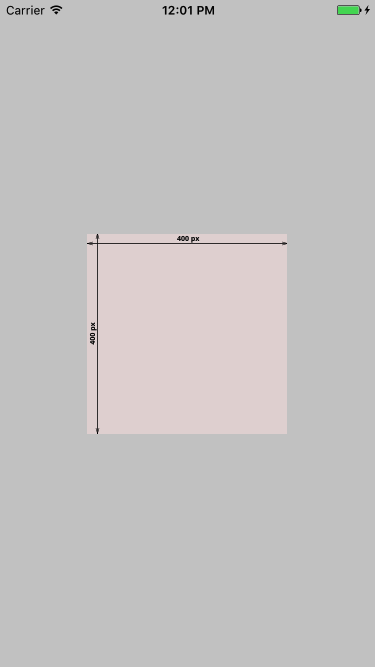
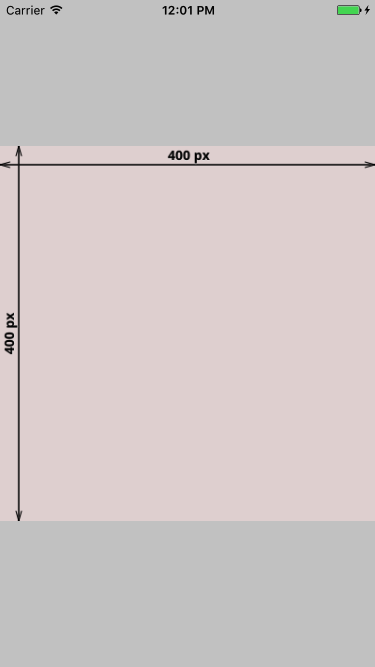
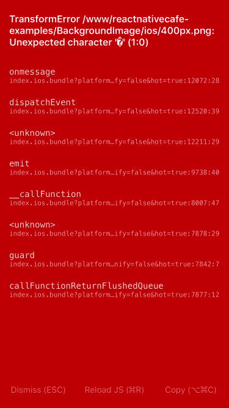
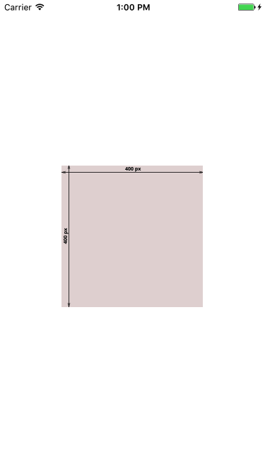
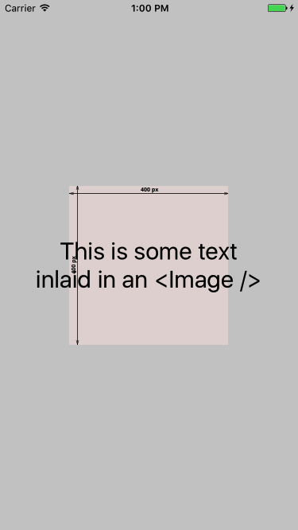
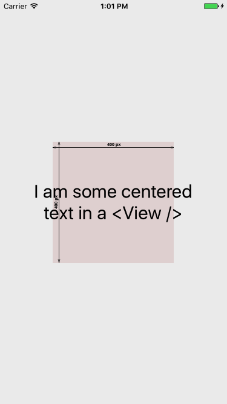

title: Background Images in React Native
---
A [common question][1] amongst React Native developers is how to put a background image on a view.

On the web, it’s a piece of cake:

```
<div style={{ backgroundImage: 'url(/my-image.png)' }}>...</div>
```

In React Native, there’s no `background-image` tag; instead, the `<Image>` component does the heavy lifting.

## Layouts

<a href="https://s15.postimg.org/tw2qkvmcb/400px.png" target="_blank" class="right-image">

<small>Our sample image</small>
</a>
There’s [5 layouts][2] to be aware of that an image can take.

- `center` - Centers the image, without resizing it.
- `repeat` - Repeats the image, without resizing it.
- `stretch` - Stretches the image to fit its bounds, without preserving the image's aspect ratio.
- `contain` - Resizes the image to fit its bounds, while also preserving its aspect ratio.
- `cover` - Resizes the image so its shorter side fits its bounds, while also preserving its aspect ratio. In practice, this means that the longer side while overlap the borders of its bounds.

Here's examples of each in practice:
<div class="flex-table">
  <a href="assets/400px/center.png" target="_blank">
     Center
  </a>
  <a href="assets/400px/repeat.png" target="_blank">
     Repeat
  </a>
  <a href="assets/400px/stretch.png" target="_blank">
     Stretch
  </a>
  <a href="assets/400px/contain.png" target="_blank">
     Contain
  </a>
  <a href="assets/400px/cover.png" target="_blank">
     Cover
  </a>
</div>

## Referencing images
If you haven't used `<Image />` before, a quick note on assets. There's two ways of serving images, over the network and locally. Using local images will be faster but result in a larger app binary, and can't be updated on the fly.

If you're using remote images, keep in mind two things:

1 - Use `https` links instead of `http`. [Apple will block non-`https` links][3], and in my experience this error will happen silently.
2 - For larger images, explore the caching policies [detailed here][4] to reduce network requests for your users.

If instead you decide to serve images locally, keep in mind images are served relative from your app root folder. I usually put my local images into an assets folder with other media, so from `index.ios.js` I can call them with:

`require('./assets/my-image.png')`

Finally, if you add a new image to your app and come across an error like this:



It probably means you need to restart your packager, so it can pick up the imported image.

## Examples
Let’s show an example where we fetch an image from a public URL and position it absolutely:

<div class="flex-table">
  <script src="https://gist.github.com/thekevinscott/0381ad0ff8e2fe29c47f0e1ab71d5b74.js"></script>
  
</div>

Easy as that! The key is the use of `flex: 1`, which will cause the `<Image />` component to fill its container. You can read [more about Flexbox here][5].

You can play around with `resizeMode` to see the different layout options.

## With Text

Usually a background image sits behind something else. There’s two ways to achieve that: using the `<Image />` as the view layer itself, or wrapping it in another `<View />`.

Here’s an example using the `<Image />` as the wrapper component:

<div class="flex-table">
  <script src="https://gist.github.com/thekevinscott/0b2ba3dbd3e3c0b2efd9fd91a08a7696.js"></script>
  
</div>


And here’s an example wrapping the `<Image />` in a container `<View />`:

<div class="flex-table">
  <script src="https://gist.github.com/thekevinscott/114fc100d47f68b5bd805c9fd32c35c0.js"></script>
  
</div>

I slightly prefer the latter approach, as I think it's more flexible if you need to make further adjustments or include other elements, but either approach works.

[1]:	http://stackoverflow.com/questions/29322973/whats-the-best-way-to-add-a-full-screen-background-image-in-react-native
[2]:	https://facebook.github.io/react-native/docs/image.html#resizemode
[3]:	https://developer.apple.com/news/?id=12212016b
[4]:	https://facebook.github.io/react-native/docs/images.html#cache-control-ios-only
[5]:	https://facebook.github.io/react-native/docs/flexbox.html
